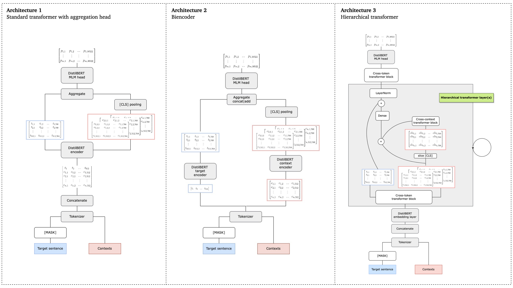

## Training transformers with structured context
#### Short summary
This project focuses on training transformer encoders that incorporate higher-order context (i.e., other text from the author and/or the subreddit) in encodings for a target text sequence. 
The rationale is that:
a) knowledge of individuals styles and/or styles associated to a given topic could produce better MLM predictions;
b) training on this context-aware version of MLM can simultaneously yield text representations at three levels: token, sequence, and potentialluy separable context representations;
c) aggregate representations of mulitple sequences from the same context could be used as "user" encodings, e.g., for prediction of individual behavior or traits.

The idea behind context-aware MLM pretraining is the following.
We feed models a target sequence and a number of ‘context’ sequences (i.e., text from the same author, or from the same subreddit) as a single example, and train models on a variant of MLM where the MLM head is fed the combination (through sum, concatenation, or token-context attention) of token-level representations from the target sequence and an aggregate representation of the contexts.

#### Models
We experiment with three DistilBERT-inspired architectures: a bi-encoder (where context and target are fed to two separate encoders), a ‘batch’ encoder (single encoder with added context aggregation and target-context combination layers) and a hierarchical encoder (applying attention across [CLS] tokens in between standard transformer layers to integrate information across contexts and target sequence). The benefits of this training protocol are evaluated both by comparing their MLM performance with no-context MLM training and to random-context training, as well as on a triplet-loss author/subreddit discrimination task. We also experiment with selective masking of attention heads based on the type of context provided (author vs subreddit) to simultaneously produce separable context representations.
They look (roughly) like this:



#### Rationale
The importance of this project is two-fold. First, this way of tuning models to produce context-aware representations may provide intrinsic advantages in NLP tasks (e.g., for MLM, knowledge of the author may make it easier to accurately reconstruct missing words), without substantial increase in model complexity. Secondly, text-based representations of text authors could be used to predict individual traits, following the intuition that linguistic behavior is systematically influenced by personality, experiences, etc.


#### Status
This project is still in progress, and it has so far been a great source of learning and of motivation to keep working with deep learning and NLP. I had to build a large-scale Reddit dataset from scratch, a ‘big data’ experience that gained me proficiency in SQL, and I have become increasingly proficient in Tensorflow for both model engineering, distributed training, and efficient data pipelines. Being a self-taught ML engineer, I have made all possible rookie mistakes in the process and have greatly benefitted from each of them.

The project started as a collaboration with Tal Yarkoni, but I have been responsible for implementation throughout and for its evolution in the last months. Code is publicly available in this repository. Planning on making everything nice and tidy once write-up is close, and to share the dataset for public use.


#### Some notes on the repo
The Reddit dataset generated through the code in ```reddit/preprocessing``` is not uploaded for storage reasons. It is a ```TFRecords``` datasets that gets streamed during training.
Models are defined in ```reddit/models.py``` and auxiliary layers are defined in ```reddit/layers.py```. I am still experimenting with the architectures, so there's a few parameters to set for each of those.
Functions for (distributed) training and logging are in ```reddit/training.py``` and ```reddit/logging.py``` respectively.


